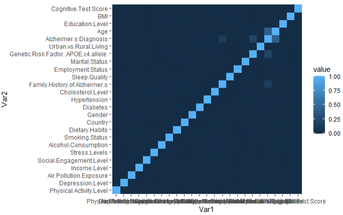
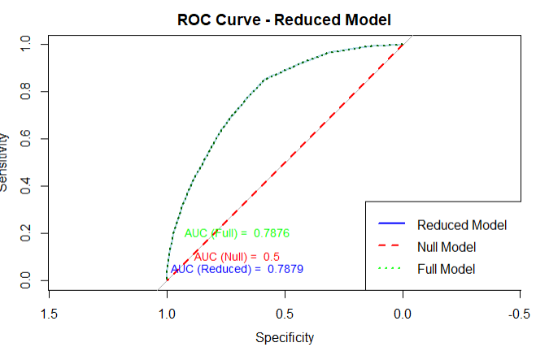
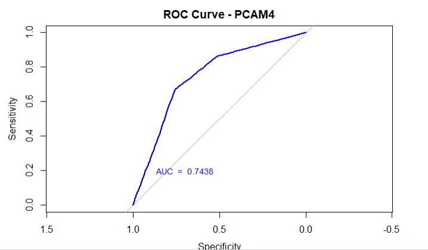

# Alzheimer’s Disease Prediction Model

## Overview
This project builds a predictive model to estimate the likelihood of Alzheimer’s disease using patient data. The goal is to identify key features associated with disease risk and evaluate model performance using classification techniques.

## Tools Used
- Python
- pandas
- scikit-learn
- matplotlib / seaborn

## Dataset
The dataset contains patient-level features relevant to Alzheimer’s diagnosis, including demographic and clinical variables.

## Process

### Data Cleaning
- Handled missing values
- Standardized numerical features
- Encoded categorical variables where necessary

### Exploratory Data Analysis
- Analyzed feature distributions
- Identified relationships between variables and disease outcome
- Checked for class imbalance

### Modeling
Built classification models including:
- Logistic Regression
- Random Forest
- Principal Component Analysis

### Evaluation
- Evaluated models using accuracy, precision, recall, and F1-score
- Used confusion matrix and ROC curve to assess performance

## Key Findings
- Certain features showed strong association with Alzheimer’s risk
- Model performance improved with proper preprocessing
- Classification metrics highlighted trade-offs between precision and recall

## Visualizations

## Skills Demonstrated
- Data preprocessing and feature engineering
- Classification modeling
- Model evaluation and interpretation
- Working with healthcare datasets
- Communicating predictive insights

## Takeaways
- Demonstrates application of machine learning in healthcare
- Highlights importance of evaluation metrics beyond accuracy

## Future Improvements
- Address class imbalance with resampling techniques
- Explore more advanced models
- Incorporate additional patient features
